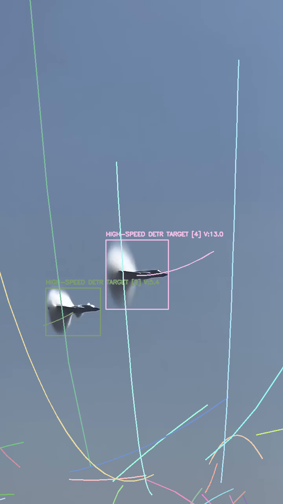
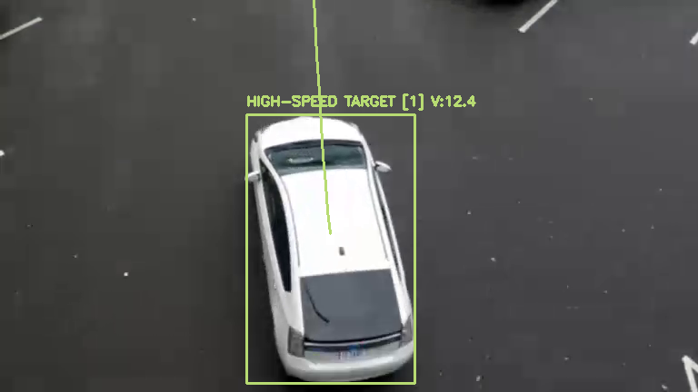

# ECE531-Final-Project
# Hybrid High-Speed Target Tracking using RF-DETR and Kinematic Filtering

This repository contains the official implementation of the term project: **"Hybrid High-Speed Target Tracking and Trajectory Prediction Using RF-DETR and Kinematic Velocity Filtering"**. 

The project proposes a domain-agnostic "Tracking-by-Detection" pipeline that seamlessly integrates the spatial accuracy of state-of-the-art Detection Transformers (RF-DETR) with a custom, math-driven Kinematic Velocity Filter. 

## 🚀 Key Features

* **State-of-the-Art Detection:** Utilizes Roboflow DETR (RF-DETR) built on a DINOv2 vision transformer backbone for robust, global-context object detection.
* **Kinematic Velocity Filter:** Calculates instantaneous pixel velocity ($v = \sqrt{v_x^2 + v_y^2}$) to aggressively filter out static background noise and camera panning artifacts.
* **Predictive Trajectory Modeling:** Employs a 2nd-degree polynomial curve-fitting algorithm ($y = ax^2 + bx + c$) based on a 15-frame rolling buffer to project the future path of high-speed targets.
* **Cross-Domain Tracking:** Proven to work on both high-speed aerial targets (e.g., F-35 fighter jets) and terrestrial vehicles (e.g., highway cars) without requiring model retraining.

## 📊 Experimental Results

> **Aerial Target Tracking (F-35)**
> 
> 

> *The system successfully measures instantaneous velocity and predicts the parabolic trajectory of an F-35 jet.*

> The video link: https://youtube.com/shorts/lOAqMRpqnXg?si=ffaqGTSJh-6EdOEl

> **Terrestrial Vehicle Tracking**
> 
> 

> *The algorithm tracks a moving car by solely adjusting the minimum velocity threshold.*

## 🛠️ How to Run

This project is built and optimized for **Google Colab**, making it incredibly easy to reproduce the results without any local environment setup.

1. Open the notebook in Google Colab: 
   
2. Ensure the Runtime is set to **GPU** (`Runtime > Change runtime type > T4 GPU`).
3. Run all cells sequentially (`Runtime > Run all`).
   * *Note: The necessary sample videos (e.g., F-35 and car footage) are automatically downloaded from public drives within the code.*
4. If an error you get about rfdetr's unrecognize, you can write the "pip install rfdetr" in terminal.

## 📂 Repository Structure

* `ECE531_Project.ipynb`: The main Jupyter Notebook containing the complete hybrid tracking architecture, from RF-DETR initialization to kinematic filtering and visualization.
* `README.md`: Project documentation.

## 📝 Limitations & Future Work

While the system is highly effective, it inherits the "ID Switching" vulnerability common in Tracking-by-Detection paradigms due to occasional deep learning frame flickering. Future iterations plan to replace the Euclidean distance matching with a robust Kalman Filter combined with the Hungarian Algorithm and DeepSORT visual embeddings to enable continuous track coasting.

## 🎓 Academic Context
This codebase was developed as a Final Term Project for ECE531.

**Author:** İlker Keser
